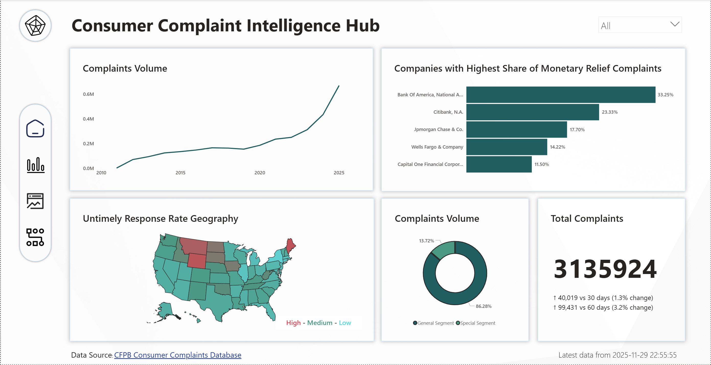
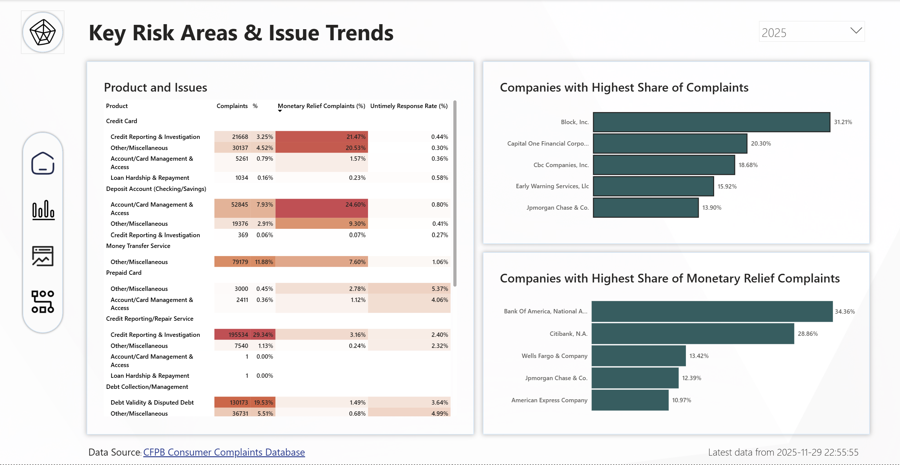
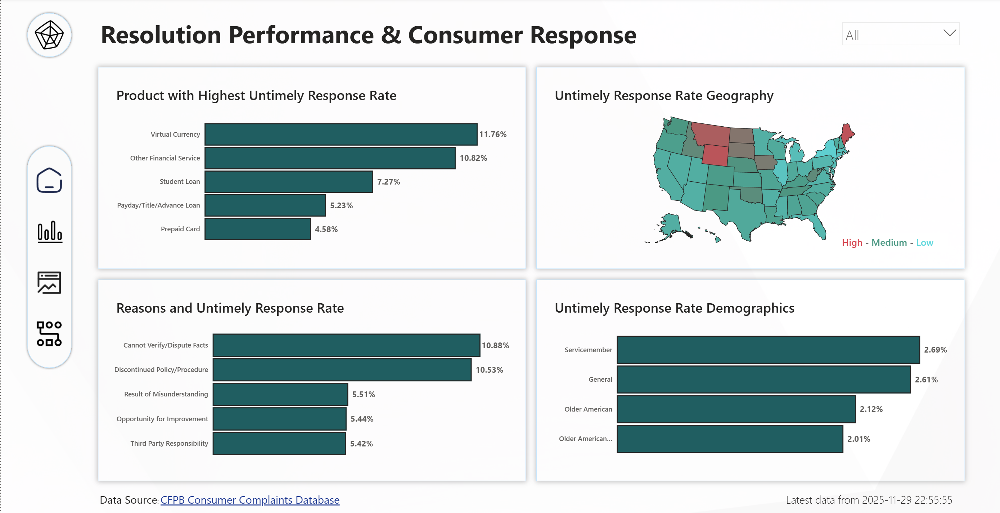
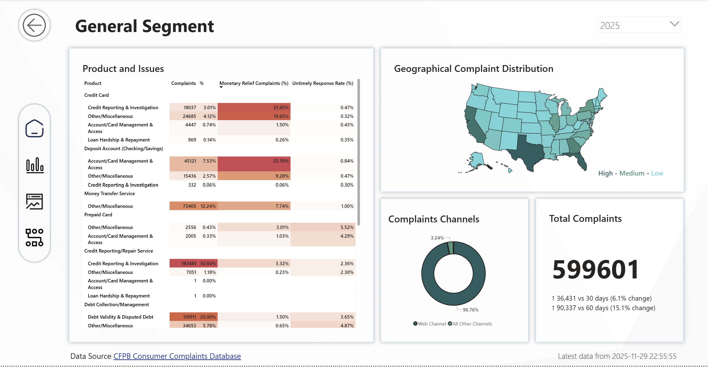
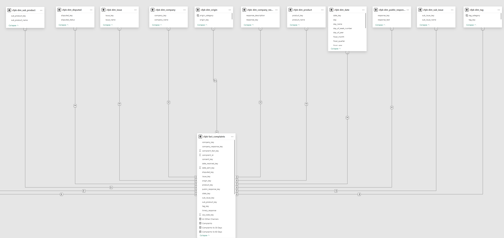

# Consumer Complaint Intelligence Dashboard

A business intelligence case study using Power BI, a dynamic ETL pipeline, and data analytics to uncover insights from the CFPB Consumer Complaint Database.

An end-to-end business intelligence solution using Power BI, Python, and SQL. This project engineers a dynamic ETL pipeline to process millions of consumer complaints, analyzes key risk areas across products and geographies, and delivers strategic insights to help financial institutions mitigate regulatory risk. It’s a complete solution—from automated data engineering and modeling to interactive dashboard design and actionable intelligence.

## Table of Contents
- [Executive Summary](#executive-summary)
- [Key Insights From Data](#key-insights-from-data)
- [Dashboard Preview](#dashboard-preview)
- [Dataset Information](#dataset-information)
- [Data Engineering & ETL Pipeline](#data-engineering--etl-pipeline)
- [Credits](#credits)

## Executive Summary
This project delivers a Power BI dashboard designed to help financial service institutions proactively identify and address emerging consumer complaint trends. Using real-world data from the CFPB Consumer Complaint Database, the dashboard analyzes complaint volume, issue types, submission channels, and company responsiveness - excluding credit reference agencies to focus on operationally relevant entities.

By surfacing friction points across products and geographies, the dashboard enables stakeholders to prioritize service improvements, enhance customer communication, and mitigate reputational and regulatory risk. The goal is to transform reactive compliance into strategic foresight - strengthening customer satisfaction and positioning institutions as proactive, data-driven leaders in consumer protection.

## Key Insights From Data

> **Note on Data Scope**: Credit reference agencies (CRAs) like Experian and TransUnion were excluded from this analysis. CRAs act as data intermediaries, not direct financial service providers, and accounted for over 85% of credit-related complaints in 2025. Their inclusion would obscure actionable insights for direct financial service providers. This focus ensures the dashboard highlights issues related to service delivery and operational performance.

As of November 29, 2025, the consumer complaints landscape for financial institutions is characterized by a high volume of submissions and critical risks in resolution, even after excluding complaints from major credit reporting agencies (Experian, TransUnion, Equifax).

The year 2025 has seen a significant and steady increase in consumer complaints recorded against financial institutions, reaching 666,468 records as of the end of November. This volume is overwhelmingly driven by the general demographic, which accounts for 89.97% of complaints, with the remaining 10.03% originating from special demographic segments (older customers, service members, and older service members).

Web Channel dominates the submission landscape, accounting for 96.57% of all complaints. Only 3.43% are received via traditional channels (referral, postal mail, phone, fax). The largest single area of complaint volume is Credit Reporting & Investigation, which takes the top spot with 195,535 complaints (a 29.34% share). This volume primarily relates to Credit Reporting / Repair Services provided by the in-scope financial institutions.

A review of complaint closures highlights acute financial and regulatory risk concentration. Bank of America is the leading institution in complaints closed with monetary relief, responsible for 34.36% of all such complaints. Citibank follows closely at 28.86%, with Wells Fargo in third place at 13.43%. The highest risk of financial harm is concentrated in two key operational areas: 24.60% of complaints related to *Deposit Accounts and Card Management Access* and 21.47% of complaints related to *Credit Card Credit Reporting & Investigation* resulted in monetary relief.

Response timeliness remains a critical service gap. Student Loans show the highest volume of untimely complaints, with a substantial 29.20% of their complaints failing to meet response deadlines. The most severe failure point is observed in policy management, where the untimely response rate spikes to 40% when dealing with complaints specifically concerning a *Discontinued Policy or Procedure*.

## Dashboard Preview
### Main Views

### Drill Through Pages

### Data Model 

## Dataset Information 
This project uses real-world data sourced from the [Consumer Financial Protection Bureau](https://www.consumerfinance.gov/data-research/consumer-complaints/#get-the-data). The data is downloaded as a bulk CSV file and processed through a custom ETL pipeline into a local MySQL server before being imported into Power BI.

### Dataset Structure
| Feature Name                 | Description                                |
|------------------------------|--------------------------------------------|
| date_received                | date complain received                     |
| product                      | product category                           |
| sub_product                  |  sub-product type                          |
| issue                        | Description of the consumer’s issue        |
| sub_issue                    | More specific issue detail (if available)  |
| consumer_narrative           | Consent status                             |
| company_public_response      | Loan amount                                |
| company_name                 | Interest rate                              |
| state_code                   | U.S. state or territory code               |
| zip_code                     | ZIP code                                   |
| tags                         | Special population flags                   |
| submitted_via                | Submission channel                         |
| date_sent_to_company         | Credit history length                      |
| company_response             | Company’s response status                  |
| timely_response              | Whether the company responded in time      |
| consumer_disputed            | Whether the consumer disputed the response |
| complaint_id                 | Unique identifier for each complaint       |

### Data Model
Data model is created from complaints data inside MySQL instead of Power BI

| Table Name                 | Description                                |
|----------------------------|--------------------------------------------|
| dim_date                   | date dimension table                       |
| dim_proudct                | product category dimension table           |
| dim_sub_product            |  sub-product type dimension table          |
| dim_issue                  | consumer’s issue dimension table           |
| dim_sub_issue              | sub issue dimension table                  |
| dim_consent                | Consent dimension table                    |
| dim_public_response        | public resposne dimension table            |
| dim_company                | company dimension table                    |
| dim_state                  | state dimension table                      |
| dim_zip_code               | zip code dimension table                   |
| dim_tag                    | population flags dimension table           |
| dim_origin                 | origin dimension table prev submitted_via  |
| dim_status                 | status dimension table prev company_status |
| dim_disputed               | disputed dimension table                   |
| fact_complaints            | complaints fact table                      |

This is how the star schema looks when imported into Power BI via the MySQL connector.

## Data Engineering & ETL Pipeline
To power the dashboard, a dynamic and incremental ETL (Extract, Transform, Load) pipeline was engineered to handle the large and continuously updated Consumer Complaint Database. The entire process is automated using Python and SQL, ensuring the data is efficiently ingested, cleaned, and modeled for analysis.

The pipeline was built to be modular and resilient, addressing the challenges of processing a dataset with over 12 million records, which occupies approximately 8 GB of database storage.

### Pipeline Architecture
The process is broken down into four distinct, idempotent steps. Each step is logged to a database, and metadata is used to track progress, meaning the pipeline only processes new or unprocessed records on each run. This makes it highly efficient for recurring updates.

1.  **Data Ingestion (`ingest`)**: The pipeline first checks the source data for updates by comparing file metadata. If new data is available, it downloads the ~1.6 GB compressed file, extracts it, and loads only new records into a raw data table (`consumer_complaints_raw`) in MySQL. This step prevents duplicate data ingestion.

2.  **Data Cleaning (`clean`)**: Once new data is ingested, a series of SQL scripts are executed to perform in-place cleaning. This includes standardizing date formats, correcting state codes, and handling `NULL` values to ensure data consistency. Each cleaned row is timestamped to avoid reprocessing.

3.  **Data Insertion (`insert`)**: Cleaned records are moved from the raw table to a separate, structured table (`consumer_complaints_cleaned`). This separation ensures that the raw data remains immutable for auditing while providing a clean, reliable source for the next step.

4.  **Data Modeling (`model`)**: The final step transforms the flat, cleaned data into a star schema, which is ideal for Power BI analytics. This involves:
    -   Populating dimension tables (`dim_product`, `dim_company`, `dim_date`, etc.) with unique values from the new data.
    -   Creating records in the `fact_complaints` table by joining the cleaned data with the corresponding dimension keys.

This star schema is then connected to Power BI, enabling fast and intuitive data exploration. The entire pipeline can be executed via a command-line interface, allowing for full runs or execution of specific steps for development and testing.

For detailed technical documentation on the pipeline, including setup and execution instructions, please see the Dynamic ETL Pipeline README.

## Credits
Image used in dashboard background is a photo by <a href="https://unsplash.com/@steve_j?utm_source=unsplash&utm_medium=referral&utm_content=creditCopyText">Steve Johnson</a> on <a href="https://unsplash.com/photos/abstract-white-geometric-shapes-with-shadows-3uts-IJslMs?utm_source=unsplash&utm_medium=referral&utm_content=creditCopyText">Unsplash</a>
      