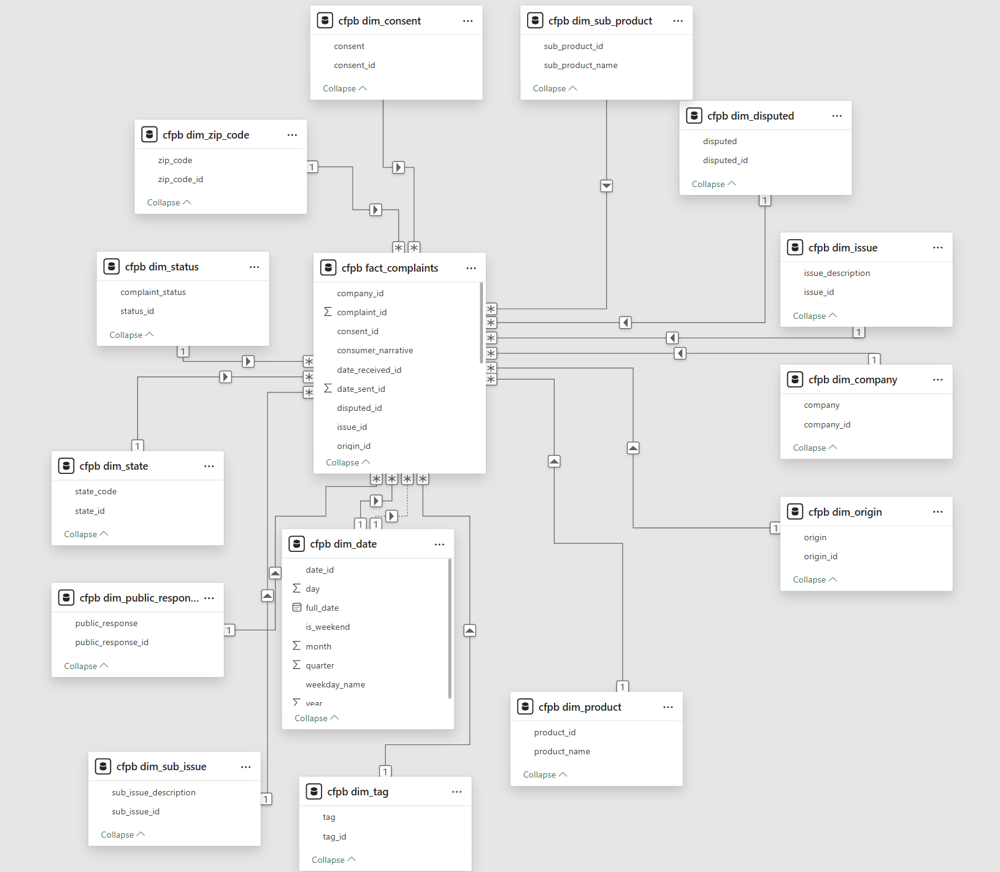

# Consumer Complaint Intelligence Dashboard
A business intelligence case study using Power BI and data analytics

## Table of Contents
- [Executive Summary](#executive-summary)
- [Dataset Information](#dataset-information)
- [Key Insights From Data](#key-insights-from-data)
- [Business Recommendation](#business-recommendation)

## Executive Summary
This project delivers a Power BI dashboard designed to help financial service institutions proactively identify and address emerging consumer complaint trends. Using real-world data from the CFPB Consumer Complaint Database, the dashboard analyzes complaint volume, issue types, submission channels, and company responsiveness - excluding credit reference agencies to focus on operationally relevant entities.

By surfacing friction points across products and geographies, the dashboard enables stakeholders to prioritize service improvements, enhance customer communication, and mitigate reputational and regulatory risk. The goal is to transform reactive compliance into strategic foresight - strengthening customer satisfaction and positioning institutions as proactive, data-driven leaders in consumer protection.

**This project uses real data from the Consumer Complaint Database maintained by the Consumer Financial Protection Bureau.**

## Dataset Information 
This is real world data sourced via [Consumer Financial Protection Bureau](https://www.consumerfinance.gov/data-research/consumer-complaints/#get-the-data). The data is downloaded as bulk CSV file, added to a local MySQL server to then be imported in to Power BI. 

### Dataset Structure
| Feature Name                 | Description                                |
|------------------------------|--------------------------------------------|
| date_received                | date complain received                     |
| product                      | product category                           |
| sub_product                  |  sub-product type                          |
| issue                        | Description of the consumer’s issue        |
| sub_issue                    | More specific issue detail (if available)  |
| consumer_narrative           | Consent status                             |
| company_public_response      | Loan amount                                |
| company_name                 | Interest rate                              |
| state_code                   | U.S. state or territory code               |
| zip_code                     | ZIP code                                   |
| tags                         | Special population flags                   |
| submitted_via                | Submission channel                         |
| date_sent_to_company         | Credit history length                      |
| company_response             | Company’s response status                  |
| timely_response              | Whether the company responded in time      |
| consumer_disputed            | Whether the consumer disputed the response |
| complaint_id                 | Unique identifier for each complaint       |

### Data Model
Data model is created from complaints data inside MySQL instead of Power BI

| Table Name                 | Description                                |
|----------------------------|--------------------------------------------|
| dim_date                   | date dimension table                       |
| dim_proudct                | product category dimension table           |
| dim_sub_product            |  sub-product type dimension table          |
| dim_issue                  | consumer’s issue dimension table           |
| dim_sub_issue              | sub issue dimension table                  |
| dim_consent                | Consent dimension table                    |
| dim_public_response        | public resposne dimension table            |
| dim_company                | company dimension table                    |
| dim_state                  | state dimension table                      |
| dim_zip_code               | zip code dimension table                   |
| dim_tag                    | population flags dimension table           |
| dim_origin                 | origin dimension table prev submitted_via  |
| dim_status                 | status dimension table prev company_status |
| dim_disputed               | disputed dimension table                   |
| fact_complaints            | complaints fact table                      |

This is how it looks like when imported in to Power BI via MySQL connector:

## Key Insights From Data

### Rationale for Excluding Credit Reference Agencies
Credit reference agencies (CRAs) act as data intermediaries, not direct financial service providers. They do not engage in customer-facing operations like lending, servicing, or account management. In 2025, CRAs accounted for over 85% of all credit reporting complaints, primarily related to data accuracy and identity theft. Including them would skew complaint distribution and obscure patterns from operationally relevant institutions. Our goal is to help financial institutions — banks, lenders, and servicers. Identify service gaps and improve customer satisfaction. CRA complaints reflect systemic data issues, not service delivery failures. By excluding CRAs, we ensure the dashboard surfaces actionable insights tied to customer experience, dispute resolution, and operational agility, areas where institutions can directly intervene.

### What is the current consumer complaints landscape.
Establishes the scale and urgency of consumer dissatisfaction, helping stakeholders understand the broader context and prioritize response strategies.

### Which complaint areas have the highest volume of consumer complaints.
Highlights operational hotspots and risk-prone areas, enabling targeted service improvements and resource allocation.

### What are the key issues being experienced by consumers.
Reveals root causes of dissatisfaction, guiding process redesign, staff training, and customer communication strategies.

### What are current complaint resolution, response timeliness and consumer complaint satisfaction benchmarks.
Supports performance benchmarking, regulatory compliance, and continuous improvement in customer experience and operational agility.

## Business Recommendation

## Credits
Image used in dashboard background is a photo by <a href="https://unsplash.com/@steve_j?utm_source=unsplash&utm_medium=referral&utm_content=creditCopyText">Steve Johnson</a> on <a href="https://unsplash.com/photos/abstract-white-geometric-shapes-with-shadows-3uts-IJslMs?utm_source=unsplash&utm_medium=referral&utm_content=creditCopyText">Unsplash</a>
      